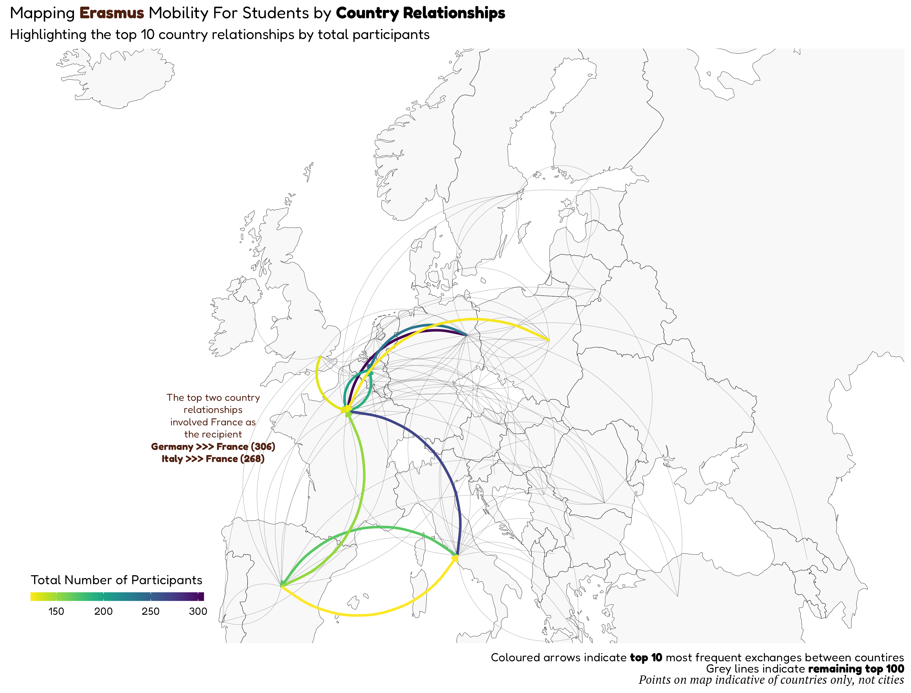
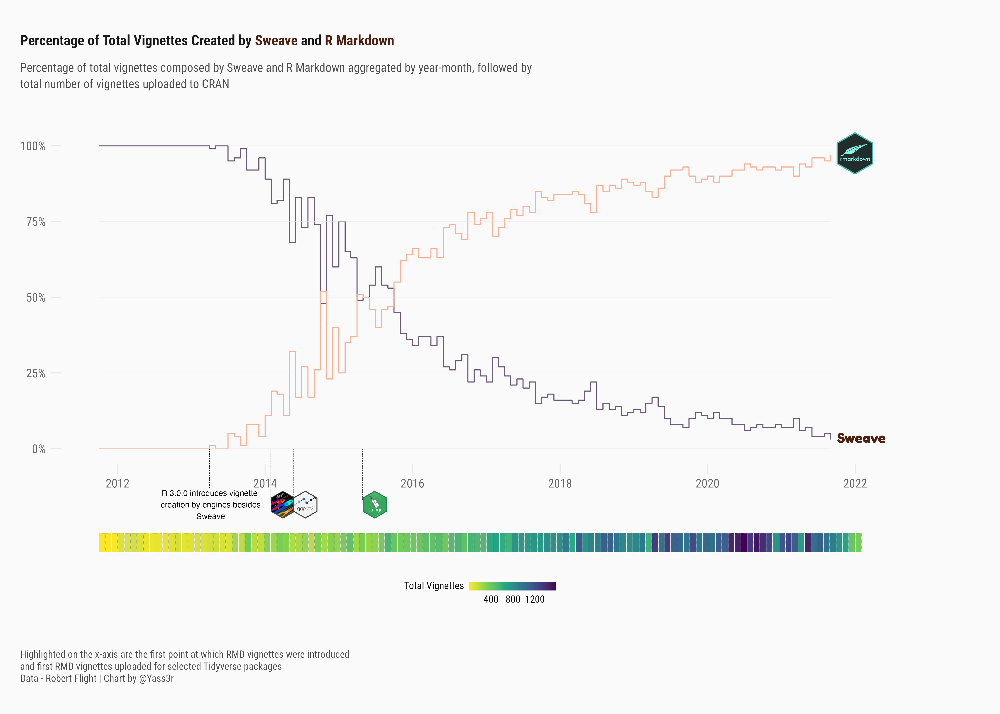
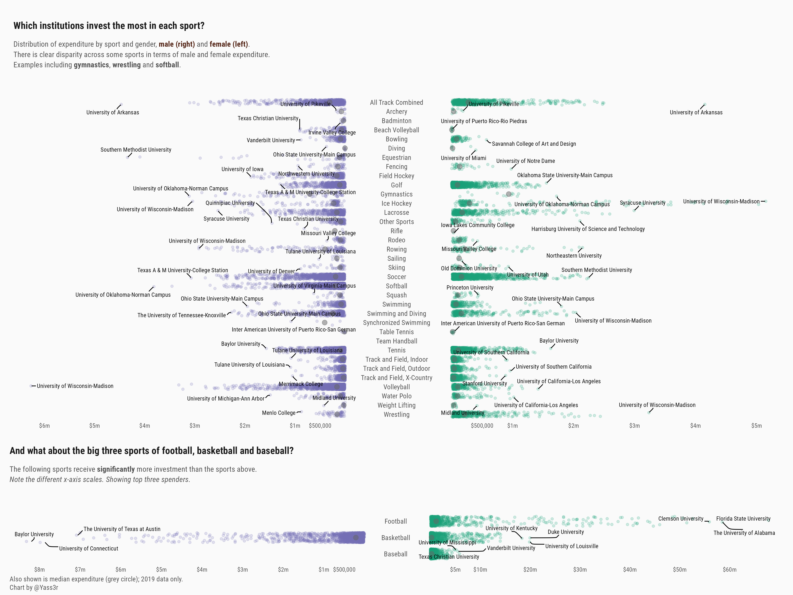

# TidyTuesday
Submissions to the #TidyTuesday - weekly social data project. 

### 22-03-08
The ERASMUS program - EU student mobility shown via relationship map. [Code](https://github.com/Ya5s3r/TidyTuesday/blob/main/2022/22-03-08/EU-Student-Mobility.Rmd)

### 22-03-15
Analysis of CRAN vignette uploads by type - R Markdown and Sweave. The chart displays the shift away from Sweave based vignettes to those based on R Markdown. Also shown are the total number of vignettes created. All metrics aggregated by year-month.
[Code](https://github.com/Ya5s3r/TidyTuesday/blob/main/2022/22-03-15/cran.Rmd)

### 22-03-22
A look at baby names as a proportion of total births per year. Analysis of name diversity in the USA for selected years.
[Code](https://github.com/Ya5s3r/TidyTuesday/blob/main/2022/22-03-22/babynames.Rmd)

### 22-03-29
Analysis of collegiate sport expenditure by gender in 2019,
[Code](https://github.com/Ya5s3r/TidyTuesday/blob/main/2022/22-03-29/EADA.Rmd)

