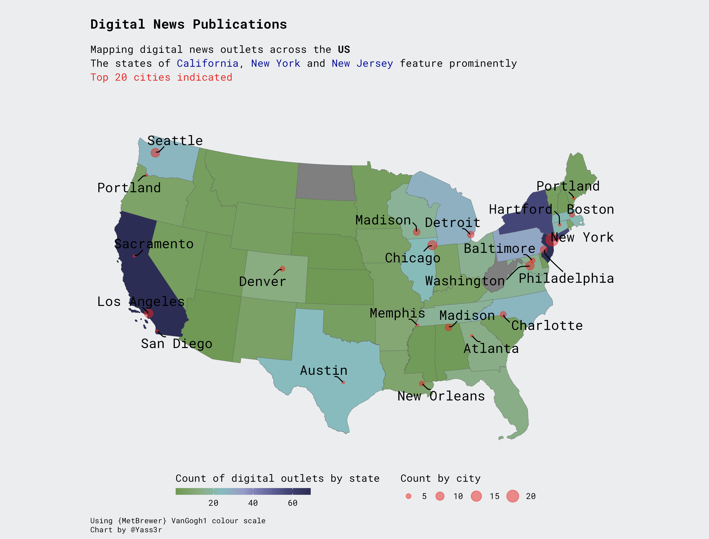

# TidyTuesday
Submissions to the #TidyTuesday - weekly social data project. 

### 22-03-08
The ERASMUS program - EU student mobility shown via relationship map. [Code](https://github.com/Ya5s3r/TidyTuesday/blob/main/2022/22-03-08/EU-Student-Mobility.Rmd)

### 22-03-15
Analysis of CRAN vignette uploads by type - R Markdown and Sweave. The chart displays the shift away from Sweave based vignettes to those based on R Markdown. Also shown are the total number of vignettes created. All metrics aggregated by year-month.
[Code](https://github.com/Ya5s3r/TidyTuesday/blob/main/2022/22-03-15/cran.Rmd)

### 22-03-22
A look at baby names as a proportion of total births per year. Analysis of name diversity in the USA for selected years.
[Code](https://github.com/Ya5s3r/TidyTuesday/blob/main/2022/22-03-22/babynames.Rmd)

### 22-03-29
Analysis of collegiate sport expenditure by gender in 2019.
[Code](https://github.com/Ya5s3r/TidyTuesday/blob/main/2022/22-03-29/EADA.Rmd)

### 22-04-05
Mapping of small, independent digital news outlets across the US - Project Oasis Study
[Code](https://github.com/Ya5s3r/TidyTuesday/blob/main/2022/22-04-05/project-oasis-digital-news.Rmd)

### 22-04-12
Slope-chart indicating % deaths attributed to indoor air pollution by nation - Our World in Data.
[Code](https://github.com/Ya5s3r/TidyTuesday/blob/main/2022/22-04-12/Indoor-Air-Pollution-Final.Rmd)

### 22-04-26
Circular visual of the Kaggle Notebooks of the Week - Hidden Gems project. Text searching for references of 'EDA' - exploratory data analysis in either the notebook title or review. It appears to be a common theme!
Inspiration from https://github.com/Ijeamakaanyene/tidytuesday
[Code](https://github.com/Ya5s3r/TidyTuesday/blob/main/2022/22-04-26/Kaggle-Hidden-Gems.Rmd)

